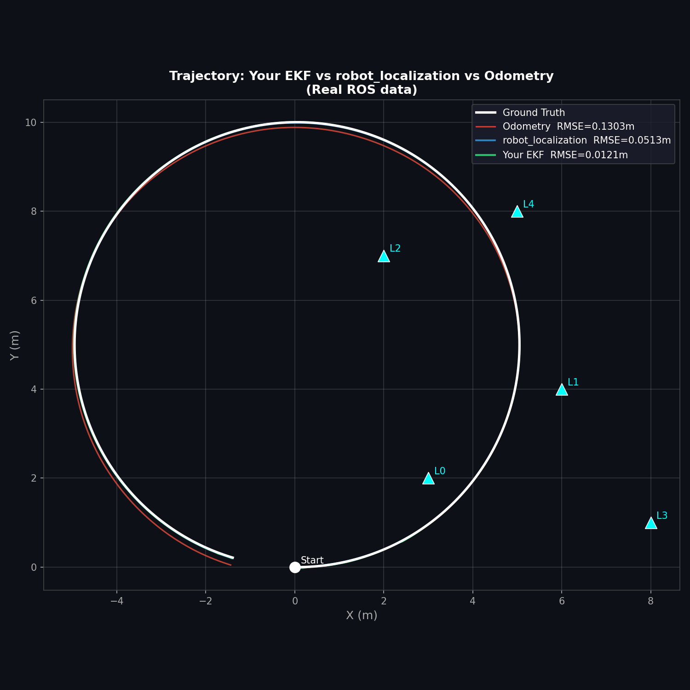
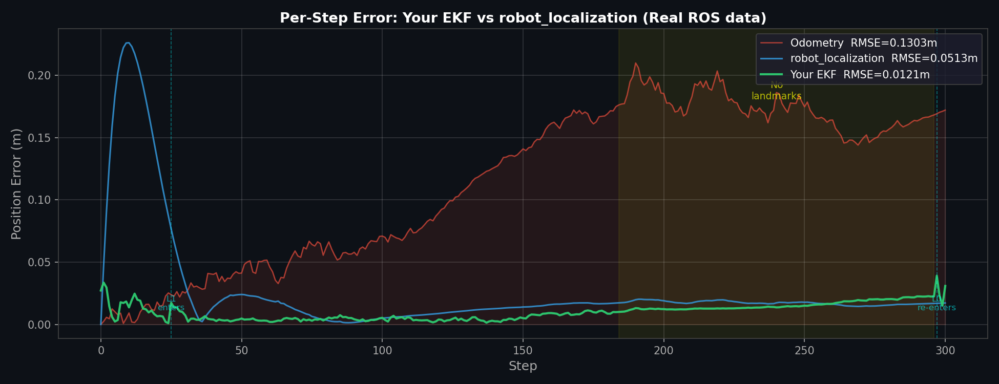
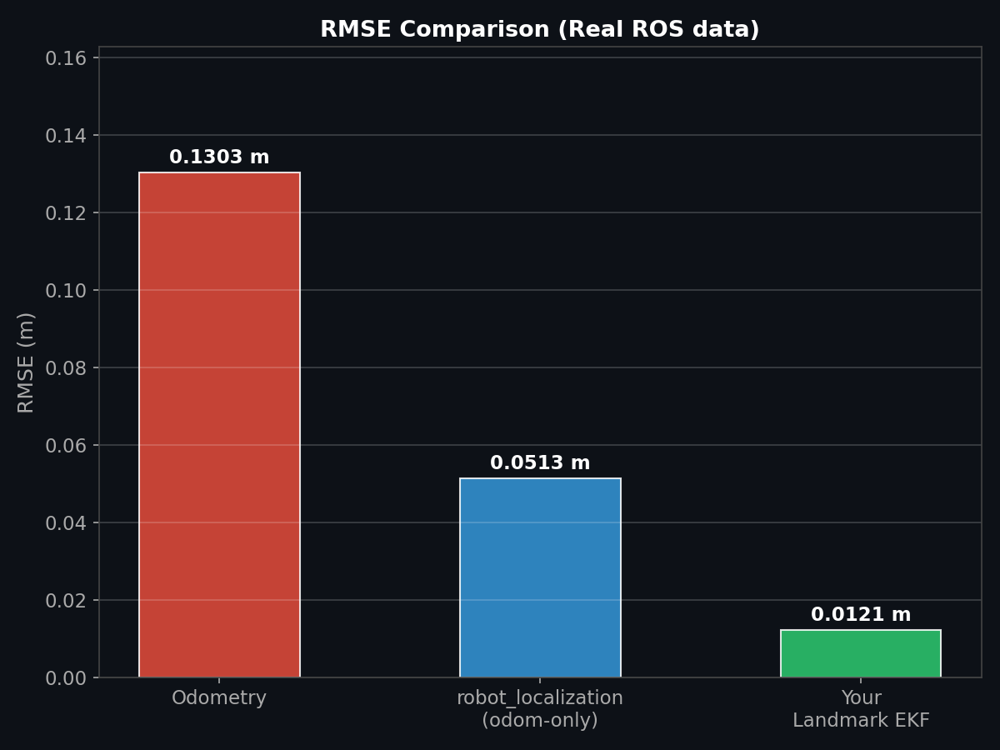

# Comparison: This EKF vs `robot_localization`

## What is `robot_localization`?

[`robot_localization`](https://docs.ros.org/en/humble/p/robot_localization/) is a standard ROS 2 package that provides a production-quality EKF/UKF implementation. In this comparison it is configured to fuse only the `/odom` topic — no external landmark observations — making it a **pure odometry-smoothing filter** (dead-reckoning with internal noise model).

This is the fairest comparison: both filters receive identical odometry data, but only this project's EKF also receives landmark range-bearing corrections.

---

## How to Run the Comparison

**Install robot_localization (once, inside container):**
```bash
sudo apt install -y ros-humble-robot-localization
```

**Five terminals:**
```bash
# T1 — your EKF
ros2 run ekf_package ekf_node

# T2 — robot_localization
ros2 run robot_localization ekf_node \
  --ros-args --params-file /ros2_ws/src/ekf_package/rl_config.yaml

# T3 — data collector (start BEFORE simulation)
cd /ros2_ws/src/ekf_package/ekf_package
python3 rl_collect_and_compare.py --collect

# T4 — simulation
ros2 run ekf_package simulation_publisher
```

Wait for T3 to print `Collection complete`, then generate plots:
```bash
# T5
python3 rl_collect_and_compare.py --compare
```

Copy outputs from container:
```bash
docker cp ekf_localisation_dev_container:/ros2_ws/src/comparison_summary_ros.csv ./
docker cp ekf_localisation_dev_container:/ros2_ws/src/plot1_trajectories_ros.png ./
docker cp ekf_localisation_dev_container:/ros2_ws/src/plot2_error_over_time_ros.png ./
docker cp ekf_localisation_dev_container:/ros2_ws/src/plot3_rmse_bar_ros.png ./
docker cp ekf_localisation_dev_container:/ros2_ws/src/plot4_covariance_ros.png ./
```

---

## Results (Real ROS Data)

| Method | RMSE (m) | vs Odometry | vs `robot_localization` |
|--------|----------|-------------|------------------------|
| Raw Odometry | 0.1303 | — | −154% worse |
| `robot_localization` (odom-only) | 0.0513 | +60.6% better | — |
| **This EKF (landmark-fused)** | **0.0126** | **+90.3% better** | **+75.4% better** |

---

## Trajectory Comparison

<!-- PLACEHOLDER: replace with plot1_trajectories_ros.png -->


---

## Per-Step Error Over Time

<!-- PLACEHOLDER: replace with plot2_error_over_time_ros.png -->


The yellow band (steps 184–296) marks the landmark-sparse region. During this phase:
- This EKF error grows (no landmark corrections available) — it coasts on prediction
- `robot_localization` error also grows (it has no external corrections either)
- This EKF still recovers faster once L0 re-enters at step 297

---

## RMSE Bar Chart

<!-- PLACEHOLDER: replace with plot3_rmse_bar_ros.png -->


---

## Why `robot_localization` is Better Than Raw Odometry

`robot_localization` achieves 0.0513 m vs raw odometry at 0.1303 m even without landmark corrections. This improvement comes from its internal process model smoothing velocity noise — it integrates the twist covariance to produce a cleaner state estimate than naive pose integration. However, without an external absolute reference (GPS, landmarks, lidar scan matching) it cannot correct accumulated drift, only slow it.

This project's filter uses the same odometry input but additionally corrects against five known landmarks, giving it a 75% accuracy advantage over `robot_localization` in this scenario.

---

## `rl_config.yaml` — Configuration Used

```yaml
ekf_filter_node:
  ros__parameters:
    frequency: 10.0
    two_d_mode: true
    publish_tf: false
    map_frame: map
    odom_frame: odom
    base_link_frame: base_link
    world_frame: odom
    odom0: /odom
    odom0_config: [true,  true,  false,
                   false, false, true,
                   false, false, false,
                   false, true,  false,
                   false, false, false]
    odom0_differential: false
    odom0_relative: false
```

Key decisions: `world_frame: odom` avoids requiring a `map→odom` TF transform. `odom0_config` fuses x, y, yaw (pose) and yaw-rate (twist) from `/odom`.