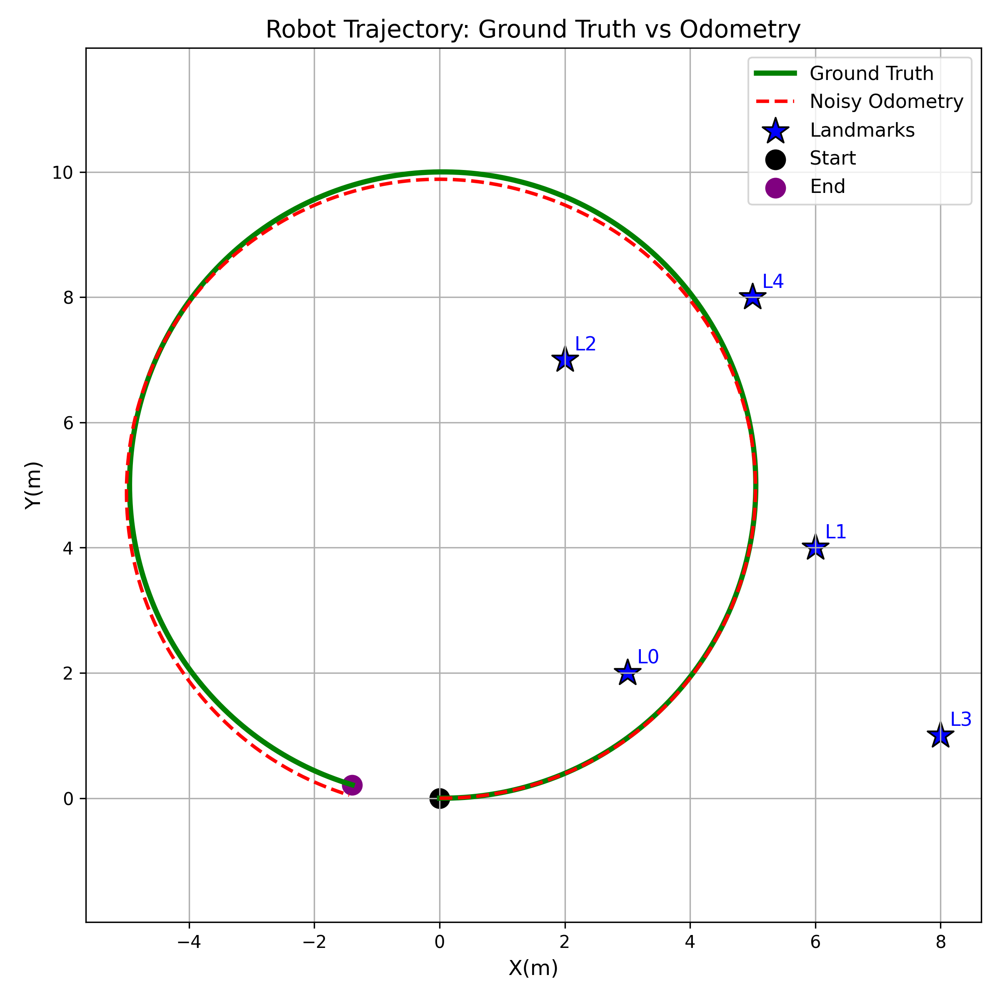
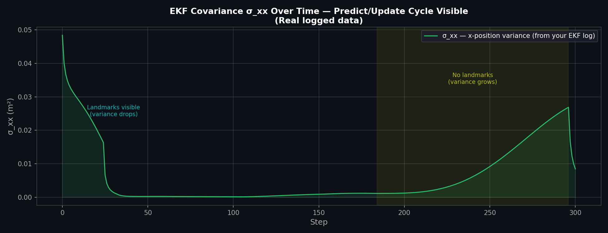

# Results & Analysis

All results are from the base scenario (moderate noise: σ_v=0.05, σ_ω=0.02, σ_r=0.2, σ_φ=0.05, seed=42) running live in ROS 2 unless otherwise noted.

---

## Trajectory Overview




The robot follows a circular arc starting at the origin. Raw odometry accumulates drift — visible as increasing separation from ground truth — while the EKF estimate (blue) tracks the true path by correcting with landmark observations.

---

## EKF Update Step Trace — First 10 Steps

All ten initial updates correspond to Landmark L0, which is within the 5 m detection radius from step 1. Two clear trends: the position estimate converges toward the true trajectory, and σ_xx falls monotonically — the filter grows more confident with each observation.

| Step | LM | Range (m) | Bearing (rad) | EKF x | EKF y | σ_xx before | σ_xx after |
|------|----|-----------|---------------|-------|-------|-------------|------------|
| 1 | L0 | 3.742 | 0.588 | −0.036 | −0.082 | 0.10010 | 0.04842 |
| 2 | L0 | 3.776 | 0.698 | 0.003 | −0.122 | 0.04848 | 0.04016 |
| 3 | L0 | 3.180 | 0.461 | 0.222 | −0.075 | 0.04036 | 0.03686 |
| 4 | L0 | 3.324 | 0.883 | 0.359 | −0.100 | 0.03682 | 0.03499 |
| 5 | L0 | 2.570 | 0.276 | 0.510 | 0.049 | 0.03509 | 0.03411 |
| 6 | L0 | 3.188 | 0.577 | 0.565 | 0.059 | 0.03404 | 0.03280 |
| 7 | L0 | 3.109 | 0.614 | 0.661 | 0.053 | 0.03270 | 0.03176 |
| 8 | L0 | 2.826 | 0.861 | 0.860 | 0.018 | 0.03147 | 0.03078 |
| 9 | L0 | 2.053 | 0.396 | 0.950 | 0.141 | 0.03064 | 0.03023 |
| 10 | L0 | 2.718 | 0.232 | 0.907 | 0.267 | 0.03003 | 0.02931 |

σ_xx drops from 0.100 → 0.029 in ten steps (~70% variance reduction in 1 second of real time). Even a single nearby landmark provides substantial localisation benefit.

---

## Trajectory Accuracy at Key Timesteps

The EKF consistently outperforms odometry in the first half of the trajectory. Steps 200–250 fall in a landmark-sparse region (no landmarks within 5 m); during this interval the filter coasts on prediction alone and EKF error temporarily exceeds odometry error. The error partially recovers near step 300 as L0 re-enters range — characteristic "coast-and-correct" behaviour.

| Step | GT (x, y) | Odometry (x, y) | EKF (x, y) | EKF err (m) | Odom err (m) |
|------|-----------|-----------------|------------|-------------|--------------|
| 10 | (0.994, 0.090) | (0.976, 0.044) | (0.907, 0.267) | 0.198 | 0.049 |
| 25 | (2.403, 0.588) | (2.392, 0.438) | (2.538, 0.529) | 0.147 | 0.151 |
| 50 | (4.230, 2.256) | (4.299, 1.941) | (4.275, 2.224) | 0.056 | 0.323 |
| 75 | (5.034, 4.596) | (5.148, 4.324) | (4.937, 4.580) | 0.098 | 0.295 |
| 100 | (4.617, 7.035) | (4.652, 6.771) | (4.681, 7.074) | 0.075 | 0.266 |
| 150 | (0.805, 9.943) | (0.729, 9.270) | (0.765, 9.808) | 0.141 | 0.677 |
| 200 | (−3.701, 8.306) | (−3.576, 7.373) | (−3.478, 7.950) | 0.420 | 0.942 |
| 250 | (−4.759, 3.630) | (−4.011, 2.587) | (−3.823, 3.157) | 1.048 | 1.282 |
| 300 | (−1.395, 0.213) | (−0.367, −0.359) | (−1.246, 0.076) | 0.203 | 1.176 |

---

## RMSE Across Noise Scenarios

Generated by `analysis/compare_rmse.py`. Re-run after any code change:

```bash
cd analysis/
python3 simulation.py          # regenerates all three scenario .npy files
python3 compare_rmse.py        # saves analysis/plots/compare_rmse.png
```


| Scenario | Odometry RMSE (m) | EKF RMSE (m) | Improvement |
|----------|-------------------|--------------|-------------|
| 1 — Low Noise | 0.0130 | 0.0125 | ~4% |
| 2 — High Noise | 0.8273 | 0.4965 | ~40% |
| 3 — Moderate Noise | 0.3241 | 0.0960 | ~70% |

**Interpretation:**
- **Scenario 1:** Odometry barely drifts at this noise level — the EKF offers only marginal gain because there is little to correct.
- **Scenario 2:** Large absolute improvement (0.33 m) but very noisy sensor readings limit how tightly the filter can constrain the estimate.
- **Scenario 3:** Strongest *relative* improvement — motion noise is moderate (enough signal to track) while landmark noise remains manageable.

---

## Covariance Dynamics

The σ_xx time series from the live ROS log illustrates the predict–update cycle:


- **Steps 1–23:** Only L0 visible. σ_xx: 0.10 → 0.017
- **Step 25:** L1 enters range. σ_xx drops sharply (two landmarks correcting simultaneously)
- **Steps 184–296:** No landmarks in range. σ_xx grows: 0.001 → 0.027 (pure dead-reckoning)
- **Steps 297–300:** L0 re-enters. σ_xx drops back to 0.008

Each update reduces σ_xx by roughly 2–4%, with larger reductions early when prior uncertainty is high. The expand-during-predict / contract-during-update pattern is the hallmark of a correctly implemented EKF.