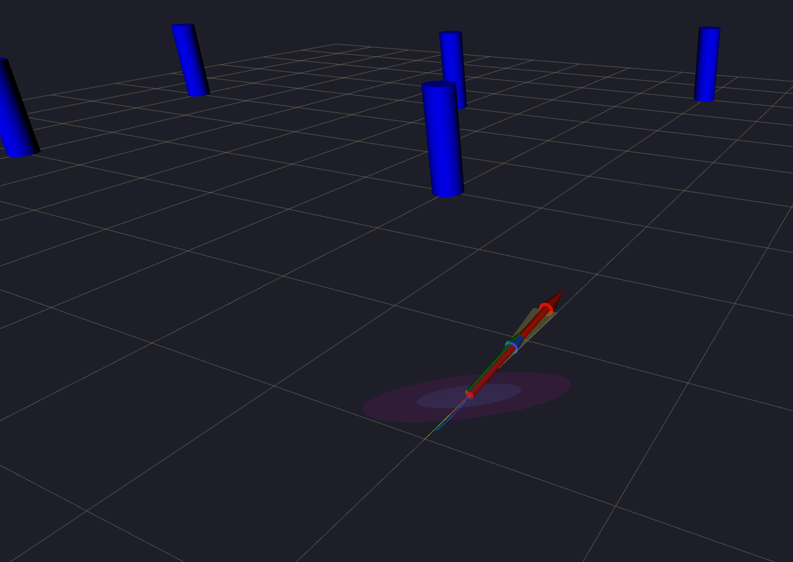
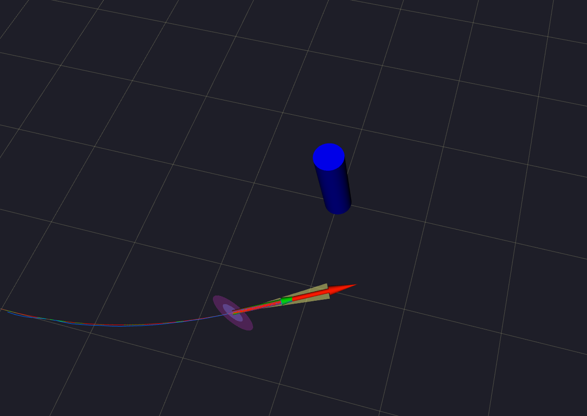
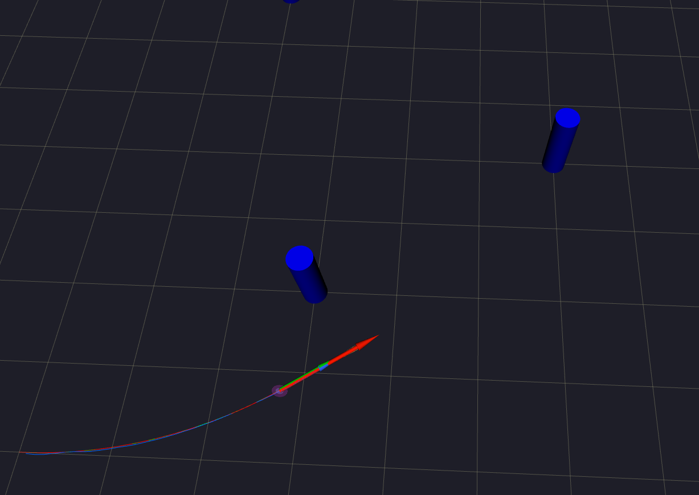
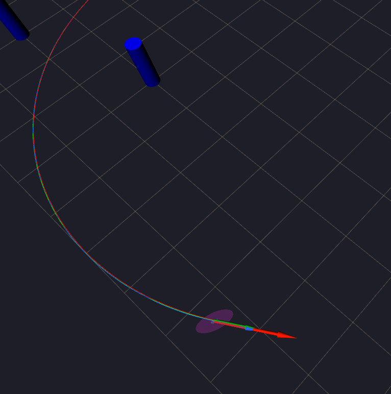
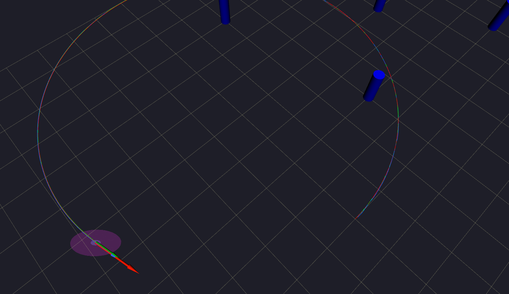
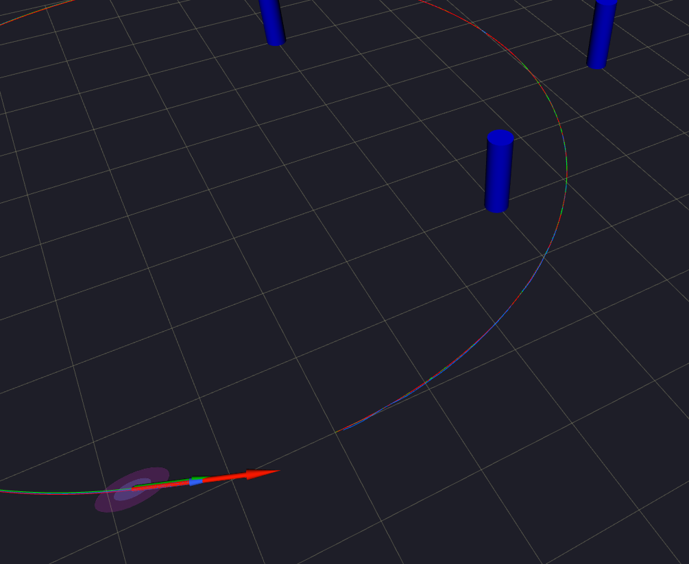

# RViz Visualisation & ROS 2 Setup

## System Architecture

```
SimulationPublisher              EKFNode                    RViz
(simulation_publisher.py)   (ekf_node.py)
        |                         |
  /odom ──────────────────────►  predict/update
  /ground_truth/pose             /ekf/estimated_pose ──────► Pose display
  /landmark_observations ──────► /ekf_path ────────────────► Path (blue)
  /landmarks                     /odom_path ───────────────► Path (red)
  /true_path ───────────────────────────────────────────────► Path (green)
```

### Published Topics

| Topic | Type | Colour in RViz | Description |
|-------|------|----------------|-------------|
| `/true_path` | `nav_msgs/Path` | Green | Ground truth trajectory |
| `/odom_path` | `nav_msgs/Path` | Red | Raw noisy odometry |
| `/ekf_path` | `nav_msgs/Path` | Blue | EKF corrected estimate |
| `/landmarks` | `visualization_msgs/MarkerArray` | Cyan cylinders | Known landmark positions |
| `/ekf/estimated_pose` | `geometry_msgs/PoseWithCovarianceStamped` | Blue ellipse | Current pose + 2σ covariance |

---

## Docker Setup

```bash
cd ros2_ws
xhost +local:docker          # allow GUI forwarding
docker-compose up --build -d
```

### One-time build (inside container)

```bash
docker exec -it ekf_localisation_dev_container bash
source /opt/ros/humble/setup.bash
cd /ros2_ws && colcon build --symlink-install
echo "source /opt/ros/humble/setup.bash" >> ~/.bashrc
echo "source /ros2_ws/install/setup.bash" >> ~/.bashrc
source ~/.bashrc
ros2 pkg list | grep ekf    # should print: ekf_package
```

---

## Running — Five Terminals

**Terminal 1 — EKF node:**
```bash
docker exec -it ekf_localisation_dev_container bash
ros2 run ekf_package ekf_node
```

**Terminal 2 — robot_localization (optional, for comparison):**
```bash
docker exec -it ekf_localisation_dev_container bash
ros2 run robot_localization ekf_node \
  --ros-args --params-file /ros2_ws/src/ekf_package/rl_config.yaml
```

**Terminal 3 — RViz:**
```bash
docker exec -it -e DISPLAY=$DISPLAY ekf_localisation_dev_container bash
rviz2 -d /ros2_ws/src/rviz_config.rviz
```

**Terminal 4 — Simulation publisher:**
```bash
docker exec -it ekf_localisation_dev_container bash
ros2 run ekf_package simulation_publisher
```

**Terminal 5 — Copy log after run:**
```bash
docker cp ekf_localisation_dev_container:/ros2_ws/src/ekf_log.csv ./ekf_log.csv
```

---

## RViz Configuration

The provided `rviz_config.rviz` pre-configures:
- Fixed frame: `map`
- Three path displays (true / odom / EKF) with distinct colours
- MarkerArray display for landmarks
- PoseWithCovarianceStamped display for covariance ellipse (scale factor 2)

---

## Covariance Ellipse — Predict/Update Behaviour

The 2σ ellipse is recovered from the top-left 2×2 block of Σ_t via eigendecomposition:

```
Σ_xy = Q Λ Qᵀ
semi-axes = 2√λ₁, 2√λ₂
angle     = atan2(q₁₂, q₁₁)
```

### Screenshots at Key Steps

The ellipse behaviour illustrates the EKF predict–update cycle directly:

| Step | σ_xx | Event | Expected ellipse |
|------|------|-------|-----------------|
| 5 | 0.034 | L0 in range from step 1 | Already shrinking |
| 25 | 0.011 | L1 enters range (two landmarks) | Small — sharp drop |
| 30 | 0.009 | Two landmarks correcting | Very small |
| 184 | 0.001 | Last landmark update | Minimum size |
| 250 | 0.027 | No landmarks (steps 184–296) | Growing — pure predict |
| 297 | 0.017 | L0 re-enters range | Shrinking again |


**Step 5 — initial correction (scale ×2):**


**Step 25 — second landmark enters (scale ×2):**


**Step 30 — two landmarks correcting (scale ×2):**


**Step 184 — covariance minimum (scale ×5):**


**Step 250 — dead-reckoning zone, maximum uncertainty (scale ×5):**


**Step 297 — L0 re-enters, ellipse shrinking (scale ×2):**
