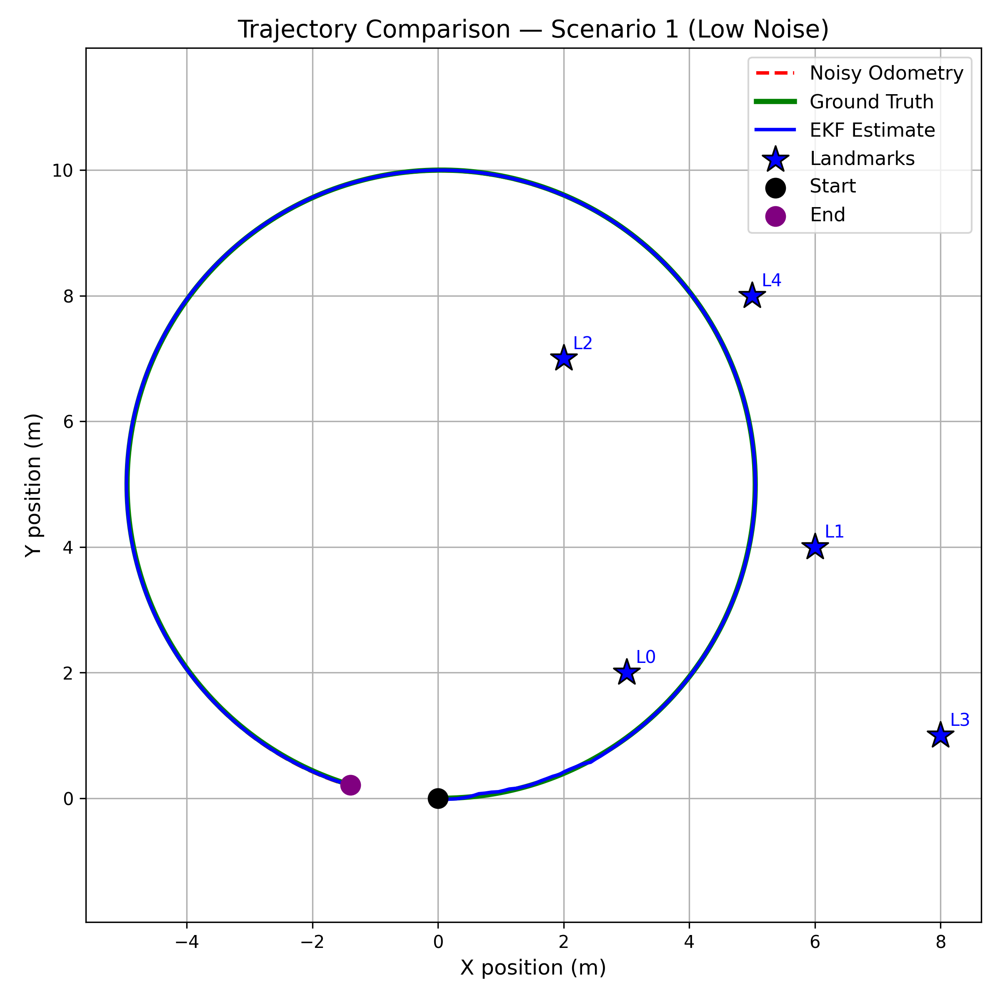
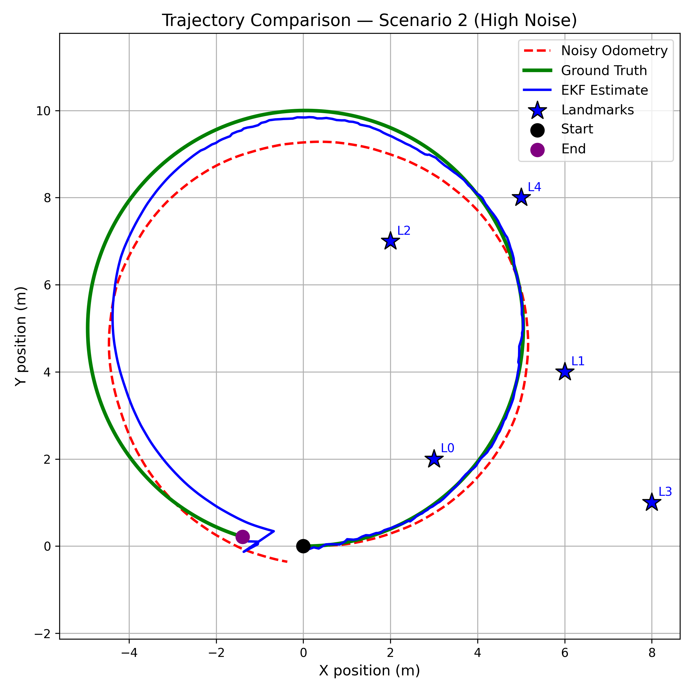
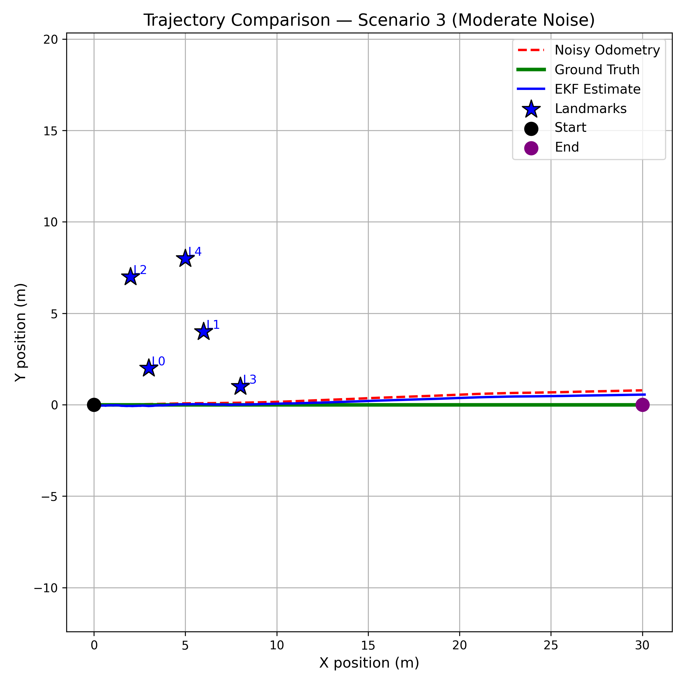
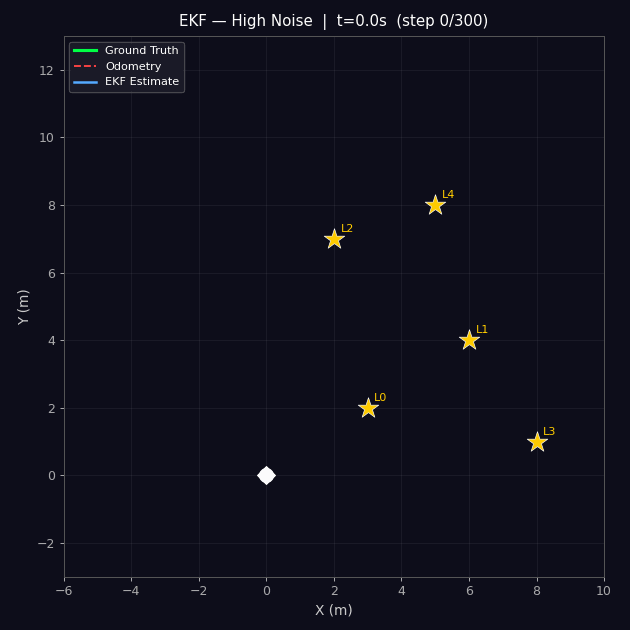
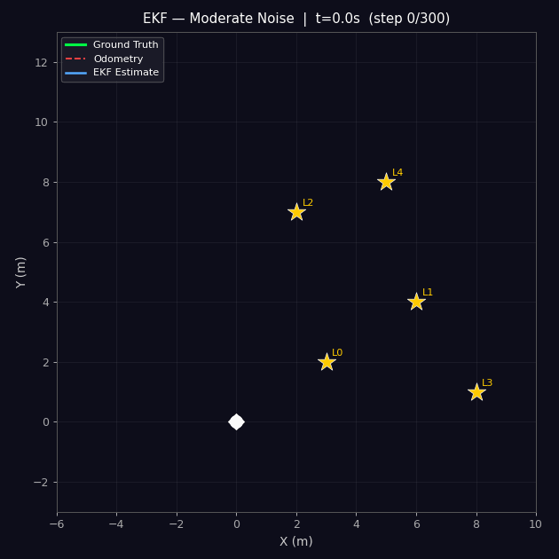

# Simulation — Mathematical Framework & Noise Scenarios

## Mathematical Framework

### State and Control

The robot pose at time *t* is **x**_t = [x, y, θ]ᵀ. Control input from wheel encoders is **u**_t = [v, ω]ᵀ.

### Motion Model (Unicycle Kinematics)

```
x_t  = x_{t-1} + v·Δt·cos(θ_{t-1})
y_t  = y_{t-1} + v·Δt·sin(θ_{t-1})
θ_t  = θ_{t-1} + ω·Δt
```

**State Jacobian G_t** (3×3) — differentiating g w.r.t. x_{t-1}:

```
G_t = | 1  0  -v·Δt·sin(θ) |
      | 0  1   v·Δt·cos(θ) |
      | 0  0        1       |
```

**Control Jacobian V_t** (3×2) — differentiating g w.r.t. u_t:

```
V_t = | Δt·cos(θ)  0  |
      | Δt·sin(θ)  0  |
      |     0      Δt |
```

**Covariance Prediction:**  `Σ̄_t = G_t · Σ_{t-1} · G_tᵀ + V_t · M_t · V_tᵀ`

### Measurement Model (Range-Bearing)

For landmark j at (m_x, m_y), with q = (m_x − x)² + (m_y − y)²:

```
r   = √q
φ   = atan2(m_y − y,  m_x − x) − θ        [wrapped to (−π, π]]
```

**Measurement Jacobian H_t** (2×3):

```
H_t = | -(m_x-x)/√q   -(m_y-y)/√q    0 |
      |  (m_y-y)/q    -(m_x-x)/q    -1 |
```

### EKF Predict–Update Cycle

| Step | Equation |
|------|----------|
| 1. Predict state | x̄_t = g(x_{t-1}, u_t) |
| 2. Predict covariance | Σ̄_t = G_t Σ_{t-1} G_tᵀ + V_t M_t V_tᵀ |
| 3. Kalman Gain | K_t = Σ̄_t H_tᵀ (H_t Σ̄_t H_tᵀ + R_t)⁻¹ |
| 4. Update state | x_t = x̄_t + K_t (z_t − h(x̄_t)) |
| 5. Update covariance | Σ_t = (I − K_t H_t) Σ̄_t |

> **Critical implementation detail:** the bearing component of the innovation `z_t − h(x̄_t)` must be wrapped to (−π, π] before the update. Without this, the filter diverges when heading crosses the ±π boundary.

---

## Simulation Parameters

| Parameter | Symbol | Value |
|-----------|--------|-------|
| Timestep | Δt | 0.10 s |
| Total steps | N | 300 |
| Linear speed | v | 1.0 m/s |
| Angular speed | ω | 0.2 rad/s |
| Landmarks | N_L | 5 |
| Max detection range | d_max | 5.0 m |
| Random seed | — | 42 |

### Landmark Positions

| ID | x (m) | y (m) |
|----|-------|-------|
| L0 | 3.0 | 2.0 |
| L1 | 6.0 | 4.0 |
| L2 | 2.0 | 7.0 |
| L3 | 8.0 | 1.0 |
| L4 | 5.0 | 8.0 |

### Noise Parameters — Three Scenarios

| Scenario | σ_v (m/s) | σ_ω (rad/s) | σ_r (m) | σ_φ (rad) |
|----------|-----------|-------------|---------|-----------|
| 1 — Low Noise | 0.005 | 0.002 | 0.05 | 0.010 |
| 2 — High Noise | 0.200 | 0.100 | 0.50 | 0.150 |
| 3 — Moderate Noise | 0.050 | 0.020 | 0.20 | 0.050 |

---

## Trajectory Plots — All Scenarios

Generated by `analysis/ekf_all_scenarios_plot.py`. Re-run after any code change:

```bash
cd analysis/
python3 simulation.py               # regenerate .npy data (seeds 42/43/44)
python3 ekf_all_scenarios_plot.py   # saves to analysis/plots/
```

### EKF Trajectory Comparison

| Scenario | Trajectory Plot |
| :--- | :--- |
| **Low Noise** |  |
| **High Noise** |  |
| **Moderate Noise** |  |

---

## Animated GIFs

Generated by `analysis/ekf_gif.py`:

```bash
python3 analysis/ekf_gif.py
```

<p align="center">
  
  
  
</p>

---

## RMSE Across Scenarios


| Scenario | Odometry RMSE (m) | EKF RMSE (m) | Improvement |
|----------|-------------------|--------------|-------------|
| 1 — Low Noise | 0.0130 | 0.0125 | ~4% |
| 2 — High Noise | 0.8273 | 0.4965 | ~40% |
| 3 — Moderate Noise | 0.3241 | 0.0960 | ~70% |

Re-run to regenerate:
```bash
python3 analysis/compare_rmse.py    # saves analysis/plots/compare_rmse.png
```